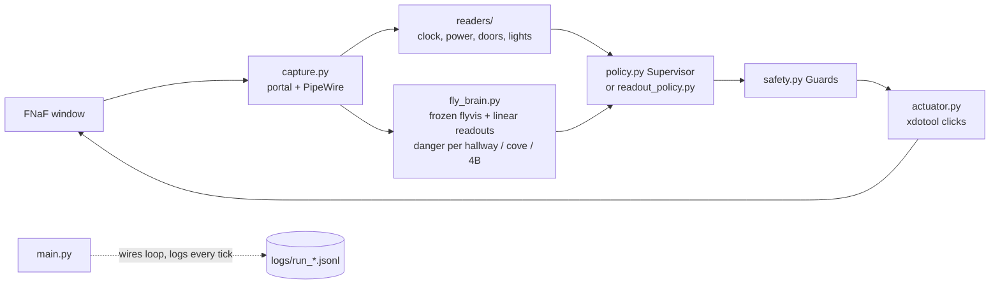

# Fruit fly visual model plays Five Nights at Freddy's 1

A bot that plays FNaF 1 using a **connectome-constrained fly visual model as perception, plus a trained linear readout**. The game
screen goes into a frozen [`flyvis`](https://github.com/TuragaLab/flyvis) network (Lappalainen et al. 2024); a linear readout over
a few of its neurons gives a danger score per hallway, and that score drives the door decisions. This is not a fly brain playing
the game: the fly model only does early vision, and everything else is ordinary code or a small fitted readout.

## What is fly, what is hand-written

| Part | Fly / learned | Hand-written |
|---|---|---|
| Visual features | frozen `flyvis` network (connectome-constrained, pretrained, never retrained) | frame resize/reprojection into its retina format (`fly_brain.py`) |
| Danger score | small linear readout over selected fly neurons, fitted on labeled frames (`fly_brain.py`, `data/templates/fly_*.npz`) | which neurons/patches, labeling |
| Door policy (sim) | linear readout policy `readout_policy.py`, imitation-initialised then ES-trained in the sim (`es_readout.py`) | hysteresis, the sim itself (`sim_env.py`) |
| Door policy (live, default) | uses the fly danger score through the `Supervisor` | `policy.py` timers, power handling, camera schedule |
| Game state readers | none (colour/template rules) | `readers/` (clock, power, doors, lights, buttons) |
| Safety | none | `safety.py` Guards / SAFE_MODE, jam rule, STOP file |
| Capture and clicks | none | `capture.py`, `actuator.py` |

Every door click carries a reason code (`scripts/audit_decisions.py` checks it). The ES-trained readout policy has only run in the
simulator so far; its live run is phase 43 (see below).

## Architecture



ASCII: `capture -> readers + fly_brain (flyvis, danger) -> policy (Supervisor | readout) -> safety Guards -> actuator -> game`.

## Run
```
source ~/.venvs/ai/bin/activate
pytest -q                                   # offline tests (the slow replay tests need data/corpus + the fitted readout)
python main.py --night 1 --viz              # live; fly neurons at http://localhost:8765
python main.py --night 1 --dry-run          # read + log only, never clicks
python main.py --night 1 --perception pixel # old pixel detector (comparison/fallback only)
touch logs/STOP                             # stop
```
See [RUNBOOK.md](RUNBOOK.md) for a live night. Linux/GNOME Wayland: screen capture goes through the xdg-desktop-portal
ScreenCast + PipeWire; clicks go to the Xwayland game window with xdotool.

## Sim comparison: Supervisor vs fly-readout policy (sim, phase 42)
`python compare_policies.py --nights 2 3 --seeds 60` (table + plot in `logs/compare/`). Paired held-out seeds, bootstrap 95% CIs. The sim is harsher than
the live game: no policy wins a simulated night (power-out dominates), so the comparison is survival time and death causes. Only 60 seeds per night
(the spec asked for 300; relaxed because the laptop overheats), so the CIs are wide. Mean survival, seconds:

| night | Supervisor | imitation readout | ES-trained readout | shuffled-feature control |
|---|---|---|---|---|
| 2 | 395 [381, 408] | 373 [362, 383] | 386 [377, 395] | 386 [376, 395] |
| 3 | 306 [280, 331] | 324 [295, 351] | 352 [329, 374] | 326 [303, 348] |

Honest reading: on Night 3 the trained readout survives longer than the Supervisor (paired +46 s, CI +18..+76) and dies to Foxy far less (8 vs 28 of 60);
on Night 2 it is slightly worse than or equal to the Supervisor (-8 s, CI -21..+5, not significant) and mostly dies of power-out. The shuffled control is
clearly worse only on Night 3 (trained minus shuffled +27 s, CI +2..+51); on Night 2 it is indistinguishable from the trained readout (+0.6 s), so the fly
signal is not shown to matter there (the readout is mostly power/door-state driven in that sim). Not a win-rate claim, and live play may differ.

## Live results (phase 43)
**TODO (phase 43, not run yet):** live nights with the ES-trained readout policy (D12 reason codes `readout_close_*` / `readout_open_*`),
survival/win numbers against the Supervisor baseline, demo GIF from `export_replay.py` / `--viz`. Nothing here is a live claim until filled in.

## Limitations
- `flyvis` is frozen. Only the linear readouts are fitted; the fly model is not trained on the game.
- The readout policy is trained in a simulator (`sim_env.py`), not in the real game. Live play may differ.
- A supervisor/guard layer (`safety.py`, jam rule, timers) sits between the policy and the clicks, so the fly/readout is not alone in control.
- Few positives for some readouts: cove (55 frames), Chica (16), no Freddy; the 4B-driven door close has not run live.
- Only 60 paired seeds per night in the sim comparison (the spec asked for 300; the laptop overheats), so the CIs are wide.
- No policy wins a simulated night (power-out dominates). The comparison is survival time and death causes, not win rate.
- Night 2 shuffled-feature control matches the trained readout (+0.6 s), so no fly-signal effect is shown on Night 2; on Night 3 the effect is small and from one comparison.
- Nights 2 and 3 were won live with the Supervisor on a thin power margin; Night 4+ is not planned.

## Offline tools
- `python fly_brain.py` refit the danger readout from the labeled corpus
- `python es_tune.py` evolution strategy over policy timings in a coarse simulated night (`sim_env.py`); writes a proposal to
  `logs/es_proposal.json`, apply with `python fit_config.py KEY=value` only after a live check
- `python -m scripts.replay_run data/corpus/n2_a 3640 3700` closed-loop replay of recorded frames (dry run)
- `python export_replay.py ...` offline replay HTML of the fly's neurons; `python evaluate.py` run statistics

## Credits
- [`flyvis`](https://github.com/TuragaLab/flyvis) (TuragaLab): Lappalainen et al. 2024, *Connectome-constrained networks
  predict neural activity across the fly visual system*, Nature.
- Five Nights at Freddy's is by Scott Cawthon; this is an unaffiliated hobby project.
