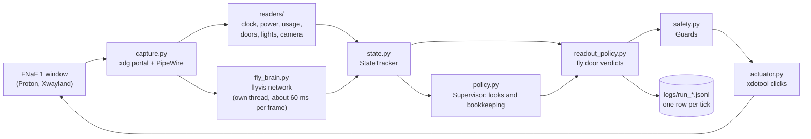
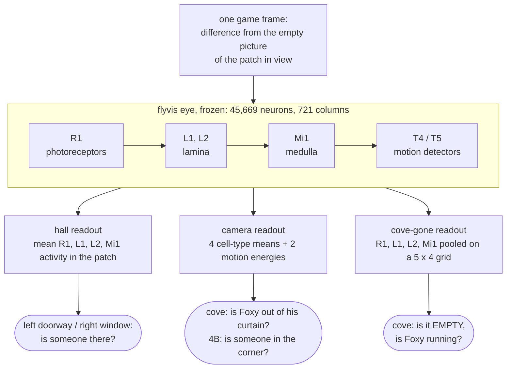
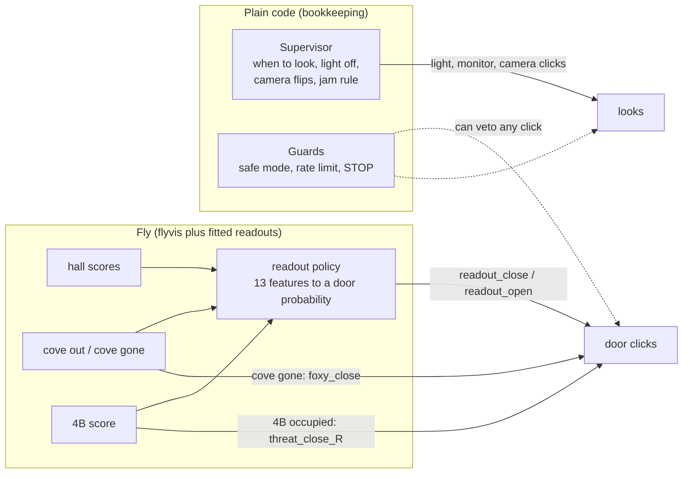
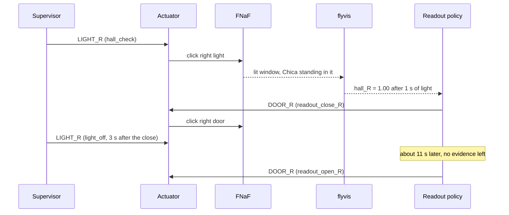
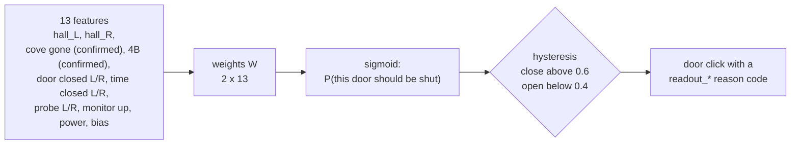
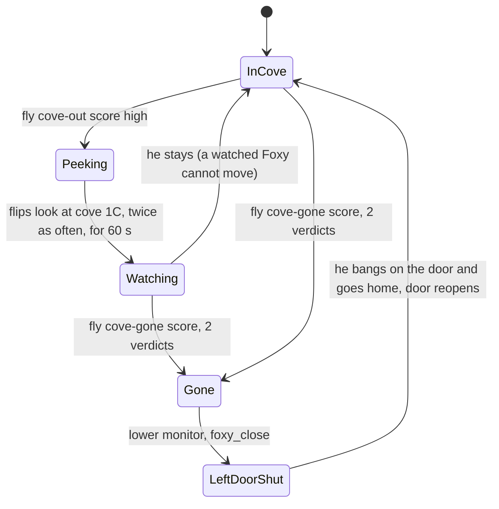

# A fruit fly's visual system plays Five Nights at Freddy's 1

This bot plays FNaF 1 on Linux. Its eyes are a **connectome-constrained model of the fruit fly visual system**
([`flyvis`](https://github.com/TuragaLab/flyvis), Lappalainen et al. 2024, *Nature*). That model is a simulated network of
**45,669 neurons of 65 cell types and 1.5 million synapses**, wired after the *Drosophila* optic lobe connectome. Every game frame
is shown to the fly's eye. Small linear readouts over a few of its neuron types turn what the fly's neurons do into "someone is in
the left doorway", "Chica is at the window", "Foxy has left his cove". Those scores decide when the office doors close and open.

**Status:** Nights 1, 2 and 3 have been won live. The Night 3 win (2026-10-05) was played with the trained fly readout making the
door decisions. 6 AM arrived about 7 seconds after the power ran out.

[](https://www.youtube.com/watch?v=fRMy38bjCZA)

> Honest scope: the fly model does early vision only (photoreceptors to motion detectors). It is not a whole fly brain, it is never
> retrained on the game, and ordinary code still decides *when to look* and keeps the bot safe. What the fly owns is **seeing** and
> the **door verdicts**: no door is ever clicked without a fly score behind it (see [Who decides what](#who-decides-what)).

## Contents
1. [The loop](#the-loop)
2. [What the fly actually does](#what-the-fly-actually-does)
3. [Who decides what](#who-decides-what)
4. [The door policy: a readout trained in a simulator](#the-door-policy-a-readout-trained-in-a-simulator)
5. [Handling each animatronic](#handling-each-animatronic)
6. [Live results and what each death taught](#live-results-and-what-each-death-taught)
7. [Running it](#running-it)
8. [Repository map](#repository-map)
9. [Limitations](#limitations)
10. [Credits and references](#credits-and-references)

## The loop

The loop runs about 10 times a second. Every pass produces one log row, so a night can be replayed and audited afterwards.



| Stage | What it does |
|---|---|
| **Capture** | Grabs the game window through the GNOME screencast portal. `mss` does not work on Wayland. |
| **Readers** | Plain code that reads the HUD: the clock, power %, usage bars, whether a door or light is on, which camera is up. They read the game state and judge no danger. |
| **Fly** | Gets every frame and returns danger scores (next section). |
| **State tracker** | Merges both into one game state. It marks which values are fresh this tick and which are held from earlier, and whether the state can be trusted at all. |
| **Policy** | Decides the next action (next sections). |
| **Guards** | Can veto anything: safe mode on an untrusted state, rate limits, a STOP file. |
| **Actuator** | Clicks the on-screen buttons with `xdotool`. |

## What the fly actually does

### The eye
`flyvis` simulates the fly's optic lobe: the photoreceptors (R1-R8), then the lamina (L1-L5), the medulla (Mi, Tm, C, T2/T3
cells) and the T4/T5 motion detectors. Its eye has 721 hexagonal columns. `perception.py` turns each game frame into
grayscale, renders it onto those 721 columns and steps the network for 100 ms of fly time per game frame. The network keeps its
state between frames, so it responds to change over time, just like the real circuit.

The network is **frozen**: the published, pretrained model (`flow/0000/000`), with no weight in it ever changed for this game.

### What the fly is shown
The bot does not show the fly the raw office. For each place it cares about, it shows how much that place **differs from its
empty reference picture**, amplified. Anyone standing there becomes a bright blob on black, whichever animatronic it is. This idea
comes from [Fly-NAF](https://github.com/ArtyMend07/Fly-NAF) (see [Credits](#credits-and-references)).

| Place (patch) | Shown when | Reference picture | Who shows up there |
|---|---|---|---|
| Left doorway | left light on | empty lit doorway | Bonnie |
| Right **window** | right light on | empty lit window | Chica. She stands in the window beside the door, **not** in the doorway. Pointing this patch at the doorway was the bug behind every right-side death until 2026-10-05. |
| Cam 1C, Pirate Cove | monitor on 1C | curtain closed | Foxy peeking, standing out, or gone |
| Cam 4B, East Hall Corner | monitor on 4B | empty corner | Chica or Freddy, one step from the right door |

### The readouts: from neurons to a score



Every readout is a logistic regression on the fly's neuron activity, fitted on recorded frames that I labeled by hand:

| Readout | What it answers | Inputs | Fitted on | Held-out quality |
|---|---|---|---|---|
| Hall | someone in the left doorway / right window | mean activity of R1, L1, L2 and Mi1 inside the patch | Bonnie frames. The right window reuses the same weights with its own empty baseline. | Bonnie: AUC 0.97. Chica in the window: 0.98 to 1.0 on all 16 frames. Empty window: at most 0.09 over 1,129 frames. |
| Cove "out" | Foxy is out of his curtain (stage 2 or later) | 6 view-wide numbers | 258 labeled cove frames | AUC 0.98 |
| Cove "gone" | the cove is empty, Foxy is running (stage 4) | 80 numbers: the four types on a 5 x 4 grid. *Where* the activity sits is what separates "standing on the stage" from "gone"; the view-wide averages could not. | 25 frames over 5 looks | 5 of 5 looks caught, 0 of 70 false looks |
| 4B | someone in the East Hall Corner | 6 view-wide numbers | Chica frames | 16 of 16 frames, 1.9% false alarms |

Each score is used once per new fly verdict and only after the camera has settled for 0.6 s. Held-over and transition-frame scores
used to count as fresh sightings and caused false door closes.

## Who decides what

The rule of the project: **the fly sees and decides about the doors; plain code only does bookkeeping.** Every door click in the
logs carries a reason code that names the fly score behind it. `scripts/audit_decisions.py` fails a run that has a door click
without one.



| Decision | Who makes it | Reason codes in the log |
|---|---|---|
| Close or open a door because of what the hall/window shows | the fly readout policy | `readout_close_L/R`, `readout_open_L/R` |
| Close the left door because the cove is empty (Foxy running) | the fly's cove-gone score, passed through by the Supervisor | `foxy_close` |
| Close the right door because someone is in 4B | the fly's 4B score, passed through by the Supervisor | `threat_close_R` |
| When to switch a hall light on, and switch it off again | Supervisor (timers plus an attention drive) | `hall_check`, `light_off` |
| When to raise the monitor and which camera to look at | Supervisor. A raised monitor freezes Foxy, so these "stall flips" are frequent. A peek seen by the fly makes them watch the cove. | `stall_flip`, `stall_cam`, `stall_down` |
| Never raise the monitor again once a door is jammed | Supervisor (game rule: a jammed door means someone is inside, and the next raise is the jumpscare) | `jam_L/R` |
| Refuse to act on garbage | Guards | `SAFE_MODE:*` |

A single look at the right window, as it happened in the winning night:



## The door policy: a readout trained in a simulator

`readout_policy.py` is one more linear readout, this time from the fly's scores to the doors.



How W was made:
1. **Imitation.** First fitted to copy the hand-written Supervisor's door choices in a simulated night (`sim_env.py`).
2. **Evolution strategy.** Then trained with an ES (`es_readout.py`) for survival time in that simulator. In the sim the
   ES readout survives longer on Night 3 than the Supervisor it started from.

`sim_env.py` is a rough model of the documented game AI: movement rolls every ~5 s, paths, door jams, Foxy's stages, power drain
fitted from live logs. Its enemy timings are approximations. It is used for training and for comparing changes, never as a
claim about the real game.

## Handling each animatronic



| Animatronic | How the fly sees it | What happens |
|---|---|---|
| **Bonnie** | left doorway patch, light on | `readout_close_L` while she stands there; reopens once the evidence is gone |
| **Chica** | right **window** patch, light on; or cam 4B | `readout_close_R` on the window, `threat_close_R` on 4B |
| **Foxy** | cam 1C, two readouts (out / gone) | A peek only makes the bot watch harder: monitor flips freeze him. An empty cove closes the left door. Closing on every peek drained the power before 6 AM. |
| **Freddy** | cam 4B | `threat_close_R`. He only gets in when 4B is unwatched, so cove looks on Night 3+ alternate with 4B looks. |
| **Power-out** | none | Power is the real limit: the winning night ended at 0%. Lights were on 37% of that night, the monitor was up 24%, the doors were shut 10%. |

## Live results and what each death taught

Every death is logged with its killer and cause. `scripts/forensics.py` builds a contact sheet of the last seconds.

| Night | Result | Notes |
|---|---|---|
| 1 | won | fly perception, Supervisor doors |
| 2 | won | Supervisor, and later the readout policy (2026-10-04) |
| 3 | won | Supervisor (2026-10-03), then the readout policy (2026-10-05): 6 AM at about 541 s, power hit 0% at 534 s |

The Night 3 campaign with the readout policy took 14 rounds; the 14th won. The deaths found these bugs:

| Death | Root cause found in the logs and frames | Fix |
|---|---|---|
| Chica through the right door, many times | the right patch looked at the empty doorway; Chica stands in the window | right patch moved to the window (`scripts/window_ref.py`) |
| Foxy, after a false left-door close | a held or transition-frame cove score was counted as fresh sightings | only fresh, settled fly verdicts count |
| Power-out at 4 AM | every Foxy peek closed the left door for 40 to 70 s | new "cove gone" readout; peeks only steer looks |
| Foxy, cove unwatched for 60 to 75 s | camera looks were too short for the fly to deliver 2 verdicts, and Night 3 flips favoured 4B | flips hold until the fly has judged the camera 3 times; the cove every 2nd flip |
| Freddy via 4B at 5 AM | a "Foxy is loose" flag stayed on after the readout reopened the door, so every flip went to the cove | the flag clears when the door is seen open again |
| Foxy while the bot was blind | a light left on over a closed door blocked every camera flip | light off 3 s after a close |

## Running it

Linux only (GNOME Wayland here). FNaF 1 runs under Proton in Bottles.

```bash
source ~/.venvs/ai/bin/activate               # Python 3.11, torch CPU, flyvis
pytest -q                                     # offline tests (replay tests need the local recordings)
python calibrate.py                           # once: hover each button / region when asked
python main.py --night 3 --policy readout --viz   # live; fly neurons at http://localhost:8765
python -m scripts.auto_night --night 3 --rounds 3 -- --viz --policy readout --record n3   # retries from the title menu
touch logs/STOP                               # stop
```

Recordings, labels and fitted readouts live in `data/`. They are not in the repository, so a fresh clone has to record, label
and fit its own (`record.py`, `label.py`, `python fly_brain.py`, `scripts/fly_danger_corpus.py`). See [RUNBOOK.md](RUNBOOK.md)
for a live night.

## Repository map

| File | Role |
|---|---|
| `main.py` | wires the loop, writes one JSON log row per tick |
| `capture.py`, `gst_pipe.py` | screen capture through the portal and PipeWire |
| `readers/` | HUD readers: clock and power digits, buttons, lights, doors, camera |
| `perception.py` | flyvis wrapper: frame to 721 hexals, 100 ms of fly time per frame |
| `fly_brain.py` | fly thread, the "difference from empty" stimulus, all fly readouts and their fitting |
| `state.py` | merges readings into a trusted game state; marks fresh vs held values |
| `readout_policy.py` | the fly door policy (13 features to door probabilities) |
| `policy.py`, `attention.py` | Supervisor: looks, camera flips, light off, jam rule, Foxy bookkeeping |
| `safety.py` | Guards: safe mode, rate limits, STOP |
| `actuator.py` | xdotool clicks and the monitor glide |
| `sim_env.py`, `es_readout.py` | simulated night and ES training of the readout policy |
| `scripts/` | auto-runner, forensics sheets, audit, replay, labeling and feature extraction |
| `live_viz.py`, `export_replay.py` | live and offline views of the fly's neurons |

## Limitations
- The fly model is early vision only and frozen. Only the small readouts are fitted.
- Several readouts rest on few examples: 25 "cove empty" frames from 5 looks, 16 Chica window frames, no Freddy frames.
- The door policy was trained in a simulator whose enemy timings are approximations.
- Plain code still decides when and where to look, and a guard layer can veto any click. The fly is not alone in control.
- The Night 3 win had no power to spare. Night 4 and later are untried.

## Credits and references
- **flyvis** (TuragaLab): J. K. Lappalainen et al., *Connectome-constrained networks predict neural activity across the fly
  visual system*, Nature (2024). <https://github.com/TuragaLab/flyvis>. The perception backbone, used frozen.
- **Fly-NAF** by ArtyMend07: <https://github.com/ArtyMend07/Fly-NAF>. A whole-brain FlyWire connectome simulation that plays
  FNaF 1. This project took its key perception idea from Fly-NAF: compare each lit hallway against a picture of the same hallway
  empty, and drive the fly with the difference, so the response does not depend on which animatronic is standing there. No code
  was copied; Fly-NAF is GPL-3.0 licensed.
- *Five Nights at Freddy's* is by Scott Cawthon. This is an unaffiliated hobby project.
